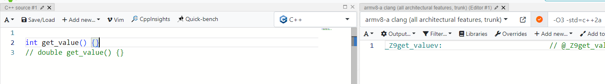
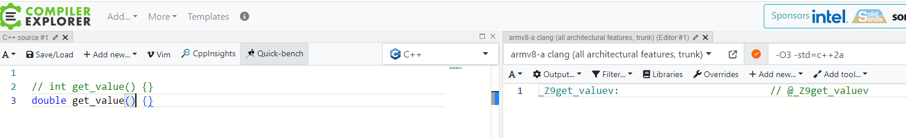
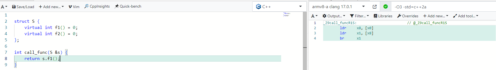
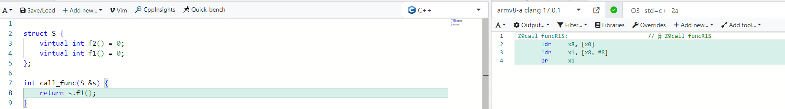
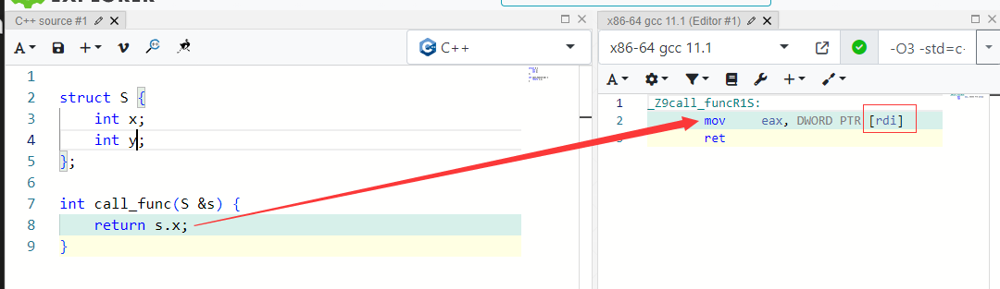
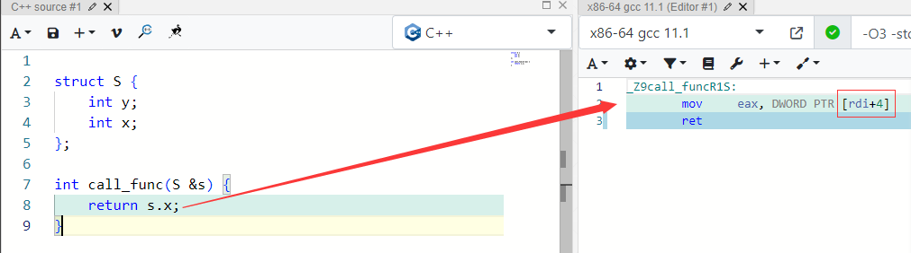
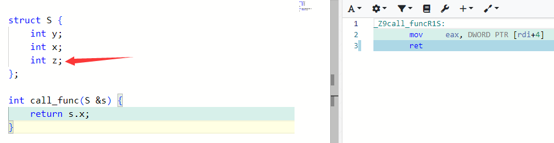

# ABI Knowledge

## What is ABI

What is **ABI**
- Application
- Binary
- Interface

Some things that are included in the discussion of ABI:

- Size, number and order of data members in a type
- Size, number and order of virtual functions
- Number and order of function parameters
- Function return types

## Changing the return type

- Return type is not part of function signature.

- Return type is not part of the name mangling[1](#refer-anchor-1), so if the header doesn't match the binary, things can go very wrong
    

    

## Changing the order of virtual functions

- If you change the order of virtual functions in the header file, the compiler will call the wrong one.

    

    

## Changing the Order of Member Variables
- Just like the virtual function order, the compiler would generate the wrong offset.
    

    
- Program needs to be recompiled, by adding the object at the end of your struct, 
it becomes undefined behavior to compiler.
    

## references

- [1] [Name Mangling Wikipedia](https://en.wikipedia.org/wiki/Name_mangling#)
