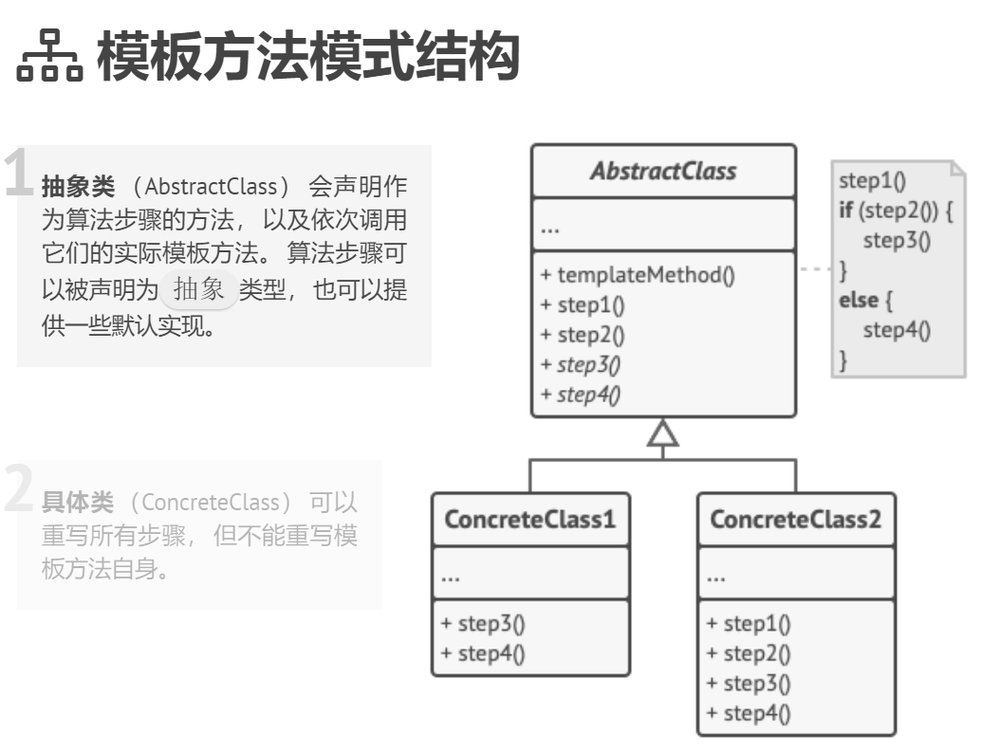
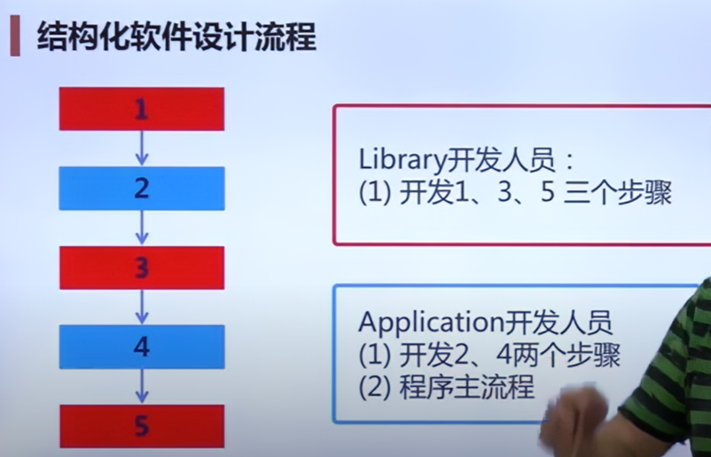
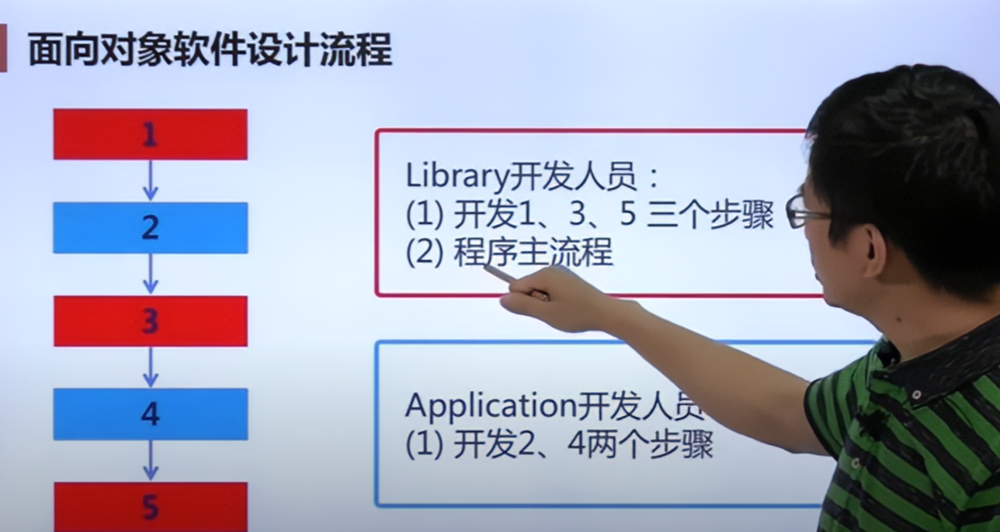
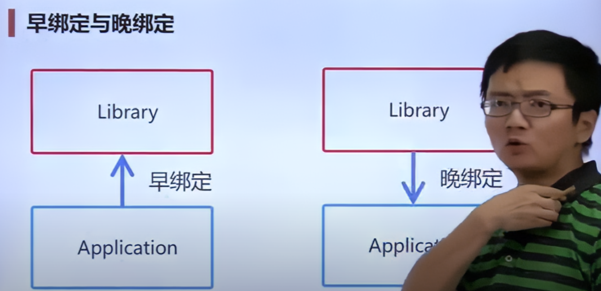
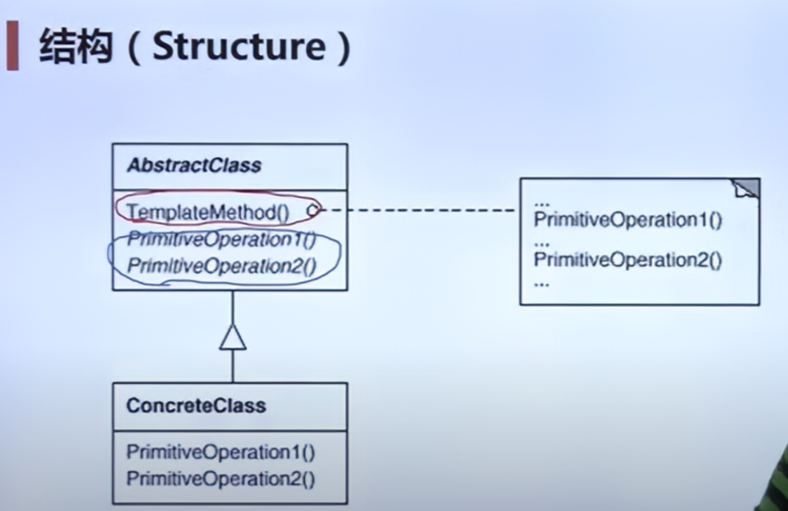
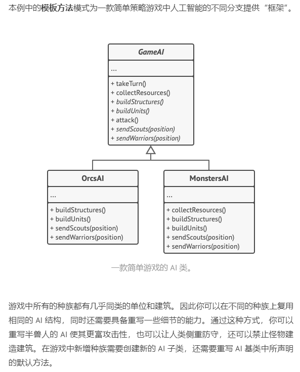

# Template Method 模板方法

## GoF中的定义

>定义一个操作中的算法的骨架（**稳定**），而将一些步骤延迟（**变化**）（一般做法是定义子类去override方法或者实现虚函数）到子类中。Template Method使得子类可以不改变（复用）一个算法的结构即可重定义（override重写）该算法的某些特定步骤。

## 组件协作模式：
现代软件专业分工之后的第一个结果是“框架与应用程序的划分”，“组件协作”模式通过晚绑定实现框架与应用程序之间的松耦合，是二者之间协作时常用的模式。


### 典型的组件协作模式：
- Template method
- Strategy
- Observer / Event

### 模板方法的模式结构

1. 将算法分解为一系列的步骤
2. 然后将这些步骤改写为方法
3. 最后在模板方法中依次调用这些方法。

步骤可以是抽象（virtual） 的，也可以有默认的实现。

客户端需要自行提供子类，并实现所有的抽象步骤，甚至重写一些步骤。



### 重构前的原有代码

这是一种早绑定的调用，应用程序开发人员调用程序库开发人员的接口，并且实现应用逻辑。



```C++ 
// 程序库开发人员
class Library{
public:
    void Step1() {
        //...
    }
    void Step3() {
        //...
    }
    void Step5() {
        //...
    }    
};
```

```C++
// 应用程序开发人员
class Application{
public:
    bool Step2() {
        //...
    }
    void Step4() {
        //...
    }
};

int main() {
    Library lib();
    Application app();
    
    lib.Step1();

    if (app.Step2()) {
        lib.Step3();
    }

    for (int i = 0; i < 4; i++) {
        app.Step4();
    }
    
    lib.Step5();

}
```

### 重构之后的代码

程序主流程转移到library开发人员



```C++
// 程序库开发人员
class Library {
public:
    void Run() { // 稳定
        lib.Step1();

    if (app.Step2()) {
        lib.Step3();
    }

    for (int i = 0; i < 4; i++) {
        app.Step4();
    }
    
    virtual ~Library(); // 基类析构函数必须是virtual，否则调用不到子类的析构函数

    lib.Step5();
    }

protected:
    void Step1() { // 稳定template method
        //...
    }
    void Step3() { // 稳定
        //...
    }
    void Step5() { // 稳定
        //...
    }
    virtual bool Step2() = 0; // 变化 留给子类来重写
    virtual void Step4() = 0; // 变化
};
```

```C++
// 应用开发人员
class Application : public Library {
protected:
    virtual bool Step2() {
        //... 子类重写实现
    }

    virtual void Step4() {
        //... 子类重写实现
    }
};

int main() {
    Library* pLib = new Application(); // 多态指针
    lib->Run(); // 调用Run()时，内部会调用子类对应的实现

    delete pLib;
}
```


### 早绑定与晚绑定

Application调用Library，是早绑定。

Library反过来调用Application的实现，是晚绑定。晚绑定是面向对象语言中的能力。



### 静态or动态？

template method 设计模式是静态的，因为模板方法在类的层次上运作，所以是静态的。

### 原理

template method 基于继承机制——扩展子类的部分内容改变算法。

### 结构



类图中的TemplateMethod()是稳定的，而若干PrimitiveOperation()是变化的。设计模式的要点：寻找稳定的部分和变化的部分。

### 更多例子



## 要点总结

1. Template Method模式是一种非常基础性的设计模式，在面向对象系统中有着大量的应用。它用最简洁的机制（虚函数的多态）为很多应用程序框架提供了灵活的扩展点（扩展就是继承+多态），是代码复用方便的基本实现结构。

2. 除了可以灵活应对子步骤的变化外，“不要调用我，让我来调用你”的反向控制结构是Template Method的典型应用。

3. 在具体实现方面，被Template Method调用的虚方法可以有实现，也可以没有任何实现（抽象方法、纯虚方法），但是一般推荐把他们设置为protected方法。